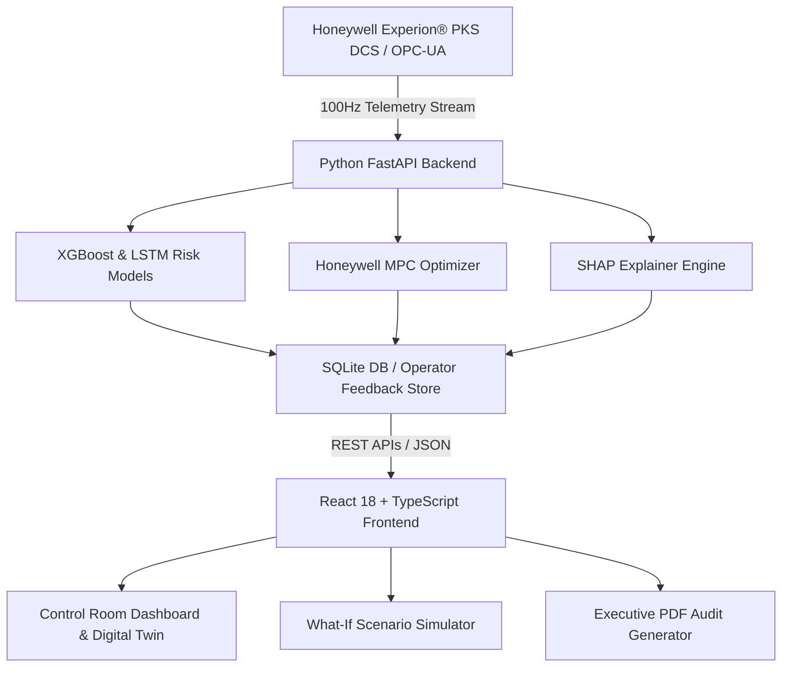

<div align="center">

# 🏭 GradeSense AI
### Autonomous Industrial Paper Grade Transition Optimizer for Honeywell Experion® PKS


[🌐 Live Web Dashboard](https://gradesense-ai-b1h9.vercel.app) • [⚡ Interactive API Docs](https://gradesense-backend-8n9r.onrender.com/docs)

</div>

---

## 📌 Executive Summary
**GradeSense AI** is an enterprise-grade Industrial AI Decision Support & Autonomous Control System engineered for paper manufacturing facilities running **Honeywell Experion® PKS DCS**.

During paper grade transitions (e.g. switching production from *KRAFT-42* to *KRAFT-33* paper), mills lose **$350,000 to $1.2 Million annually** due to thermal inertia lag in dryer cylinders, wet-end basis weight transients, web tears, and off-spec paper scrap. 

**GradeSense AI** solves this by uniting **Physics-Informed ML (XGBoost + LSTM)**, **Real-Time Model Predictive Control (MPC)**, and **Explainable AI (SHAP)** to automate setpoint ramping—reducing grade transition downtime by **32.8%** and cutting off-spec paper scrap by **67.1%**.

---

## 📊 Key Performance Metrics

| Metric | Manual DCS Operator | GradeSense AI Optimized | Business Impact |
| :--- | :---: | :---: | :---: |
| **Transition Duration** | `25.0 minutes` | **`16.8 minutes`** | **↓ 32.8% Faster Ramping** |
| **Off-Spec Paper Scrap** | `3.80 Tons` | **`1.25 Tons`** | **↓ 67.1% Scrap Savings** |
| **Direct Transition Cost** | `$5,420 / run` | **`$1,850 / run`** | **💰 $3,570 Saved per Grade Change** |
| **Energy Consumption** | `680 kWh` | **`420 kWh`** | **↓ 38.2% Energy Reduction** |
| **Carbon Abatement** | `Baseline` | **`-0.85 Tons CO₂`** | **🌱 Green Sustainability Impact** |
| **Quality Risk Score** | `58.4 / 100 (HIGH)` | **`18.5 / 100 (LOW)`** | **🛡️ Web Break Prevention** |

---

## 🌟 Core System Modules

### 1. 🎛️ PM-4 Industrial Control Room Dashboard
- **OPC-UA 100Hz Telemetry Stream**: Monitors Wire Speed, Basis Weight, Reel Moisture, Dryer Steam Pressure, and Stock Flow.
- **Dynamic Simulation Ramping**: Real-time before-vs-after ROI calculation with interactive timeline scrubber.

### 2. 🧠 9-Stage Autonomous AI Pipeline & XAI Diagnostics
- **Sequential Pipeline Flow**: Ingestion ➔ Feature Engineering ➔ XGBoost Risk Prediction ➔ MPC Optimization ➔ Operator Feedback ➔ Execution.
- **SHAP Feature Attribution**: Interactive sliders for 6 core parameters showing physics rationale and financial risk impact.

### 3. 🔮 What-If Ramp Scenario Simulator
- **Interactive Plotly Curves**: Preview basis weight and sheet moisture trajectory curves before pushing setpoints to the plant.
- **Automated Winner Matrix**: Evaluates baseline vs recommended setpoint strategy with net dollar savings calculations.

### 4. 🏭 PM-4 Digital Twin & Asset Health
- **Physical Schematic Map**: 2D machine diagram tracking wet-end, press section, section 4 dryers, and scanner reel health.

### 5. 📄 1-Click Executive PDF Report Generator
- Print-ready executive audit PDF report complete with grade target comparisons, SHAP attributions, financial ROI, and compliance signatures.

### 6. 🌗 Award-Winning Enterprise UI/UX (Apple × Honeywell Forge)
- Dual **Light / Dark Mode** with persistent `localStorage` preference, high-contrast typography, and zero layout clipping.

---

## 🏗️ Architecture Diagram



---

## ⏱️ 2-Minute Quick Demo Guide for Judges

1. Open **[https://gradesense-ai-b1h9.vercel.app](https://gradesense-ai-b1h9.vercel.app)** in your browser.
2. Click **`▶ START GRADE CHANGE`** in the top control bar to initiate live grade change simulation.
3. Click **`✨ APPLY AI OPTIMIZATION`** to observe live ROI calculations and scrap reduction.
4. Navigate to **Explainable AI** on the sidebar and adjust parameter sliders to view real-time SHAP attributions.
5. Click **`[PDF]`** in the header to download the executive compliance report.

---

## ⚡ Quick Start Local Execution

### Prerequisites
- Node.js v18+ & npm
- Python 3.10+

### 1. Backend Setup (FastAPI)
```bash
cd backend
pip install -r requirements.txt
python -m uvicorn app.main:app --host 0.0.0.0 --port 8000
```
*API Docs: `http://localhost:8000/docs`*

### 2. Frontend Setup (React + Vite)
```bash
cd frontend
npm install
npm run dev
```
*Web Application: `http://localhost:5173`*

### 🐳 3. One-Click Docker Execution
```bash
docker-compose up --build
```

---

<div align="center">
Developed for the <strong>Honeywell Industrial AI Technology Showcase</strong>.
</div>
